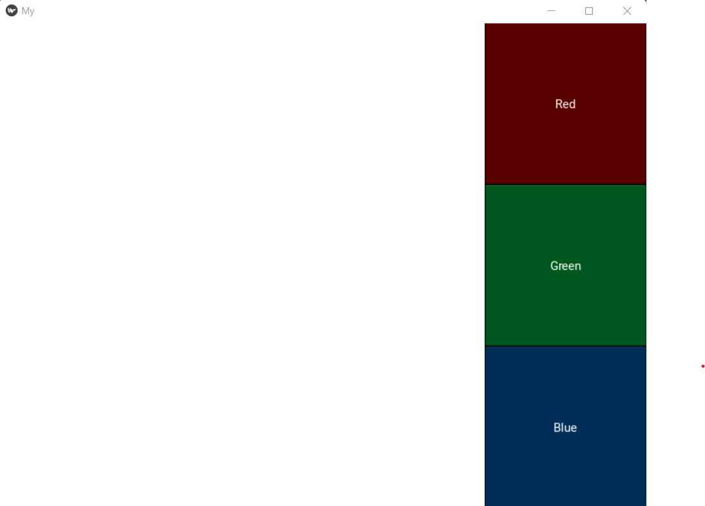
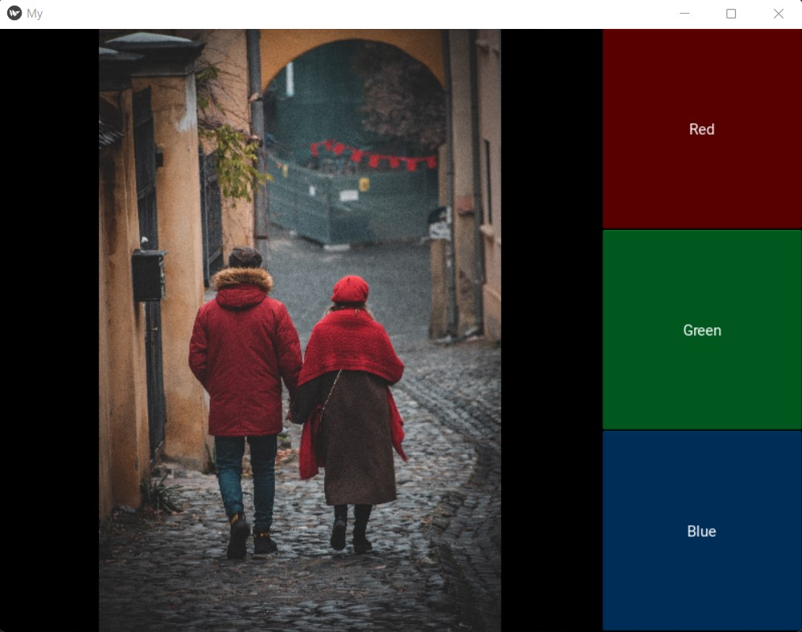
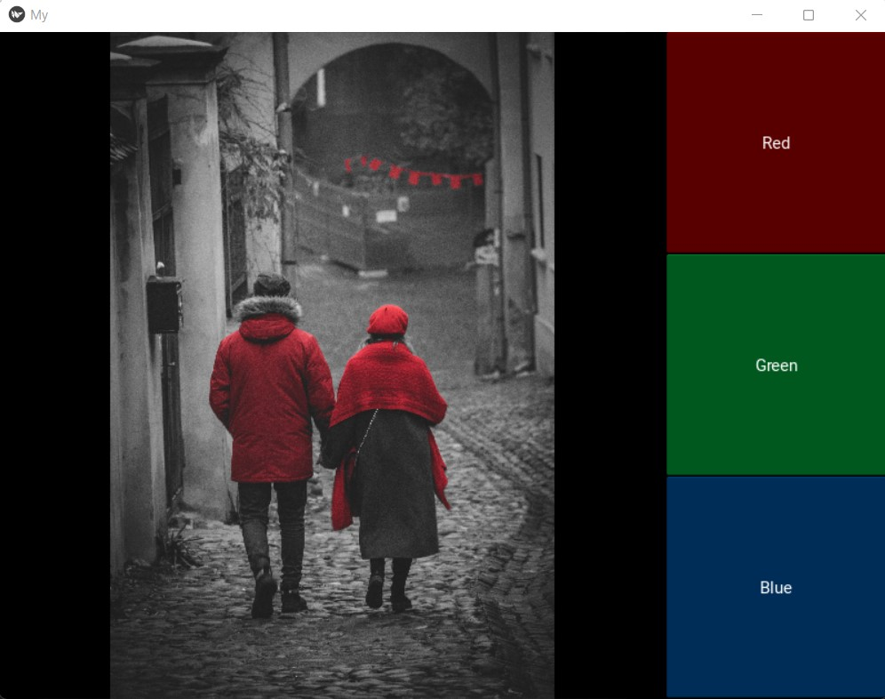

# Colour_filtering
This repository has the code implementation of my medium article, "Colour Filtering and Colour Pop Effects using OpenCV Python".
To run the application, clone this repository in your local machine and run,

```
pip install -r requirements.txt
```
This will install the required libraries in your machine or environment. After installing the libraries, run the colfilt_kivy.py file

```
python colfilt_kivy.py
```
This will open a window which looks like this



Drag and drop the image you want to filter colours on the white space



Click on any of the colour buttons. The image with the selected colour filtered will be displayed on the window.



The filtered image may take a few seconds to appear depending on the hardware available. Thank you!
